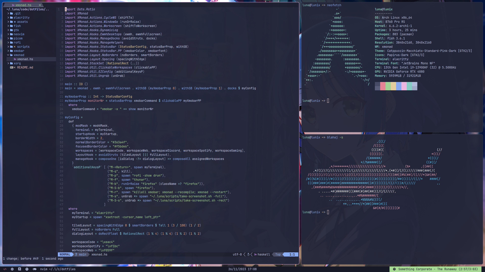

# Dotfiles

My Arch Linux configuration. This is still incomplete and also specific to my setup so it's not guaranteed to work out of the box.
This README is mostly for me in case I ever have to do this setup again and my dumb ass forgets how to do it :3.

## Software

The software used in this setup:

- Distro: [Arch](https://archlinux.org/) (btw)
- Window Manager: [XMonad](https://xmonad.org/)
- Compositor: [Picom](https://github.com/yshui/picom)
- Status Bar: [XMobar](https://codeberg.org/xmobar/xmobar)
- App Launcher: [Rofi](https://davatorium.github.io/rofi/)
- Terminal: [Alacritty](https://alacritty.org/)
- Shell: [Fish](https://fishshell.com/)
- Screenshots: [Scrot](https://github.com/dreamer/scrot)
- Text Editor: [NeoVim](https://neovim.io/)
- Browser: [Firefox](https://www.mozilla.org/en-US/firefox/new/)
- Version Control: [Git](https://git-scm.com/) with [LazyGit](https://github.com/jesseduffield/lazygit)
- File Browser:
	- Terminal: [lf](https://github.com/gokcehan/lf)
	- GUI: [Thunar](https://docs.xfce.org/xfce/thunar/start)

Some other fun tools that are completely useless but I still like to have are:

- [sl](https://github.com/mtoyoda/sl)
- [cowsay](https://github.com/piuccio/cowsay)
- [blahaj](https://blahaj.queer.software/)
